# React + Vite

This template provides a minimal setup to get React working in Vite with HMR and some ESLint rules.

Currently, two official plugins are available:

- [@vitejs/plugin-react](https://github.com/vitejs/vite-plugin-react/blob/main/packages/plugin-react/README.md) uses [Babel](https://babeljs.io/) for Fast Refresh
- [@vitejs/plugin-react-swc](https://github.com/vitejs/vite-plugin-react-swc) uses [SWC](https://swc.rs/) for Fast Refresh

  

## Screens
- Home Page
- Multivendor Register & Login type Page
- Register and Login for Admin, User and Fisherman Page
- Admin Dashboard Page
- Admin Approve and Revoke Page
- Fisherman Not Approved Page
- Fisherman Remove and Add Product Page
- Single Product Page
- Cart Page
- About Page
- Contact Page
   

## Quick Glimpses of the site :

 <table>
  <tr>
    <td>Home Page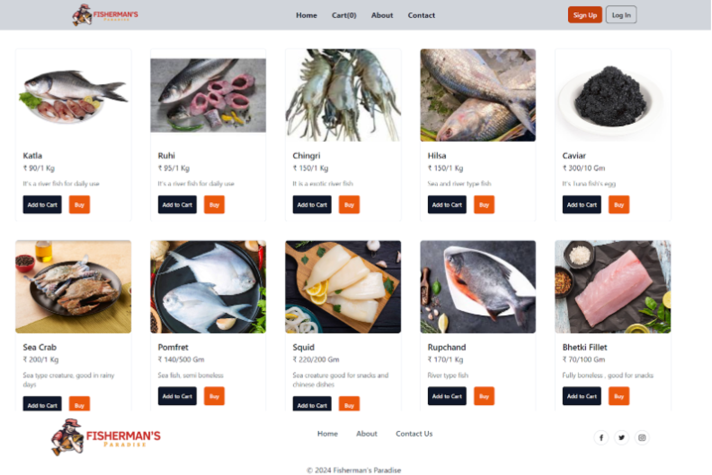 </td>
    <td>Register or Login Type Page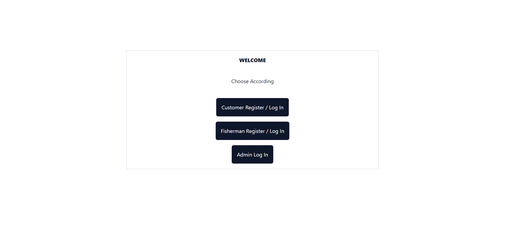</td>
  </tr>
  <tr>
    <td>Fisherman Register Page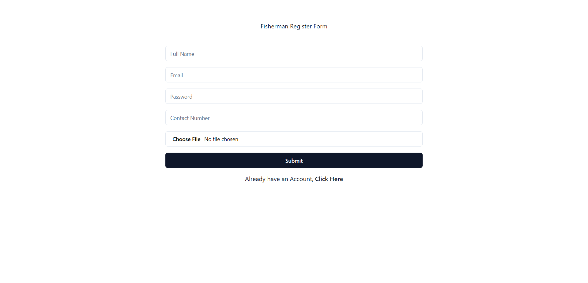</td>
    <td>Customer Register Page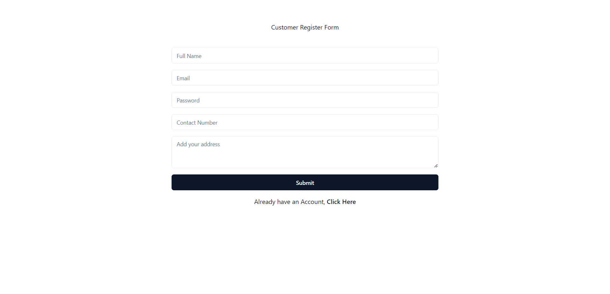</td>
  </tr>
  <tr>
    <td>Login Page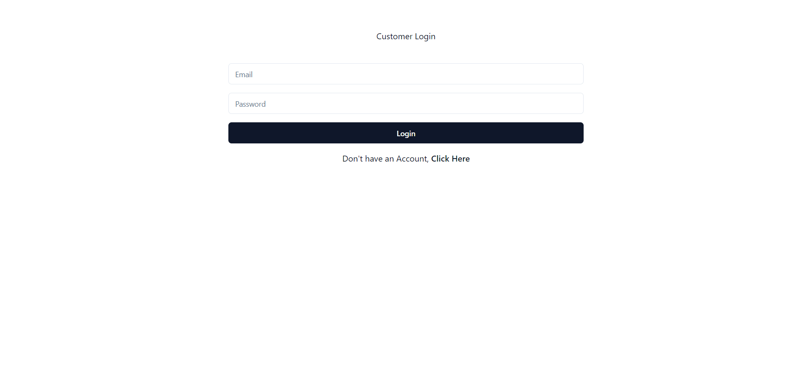</td>
    <td>Single Product Page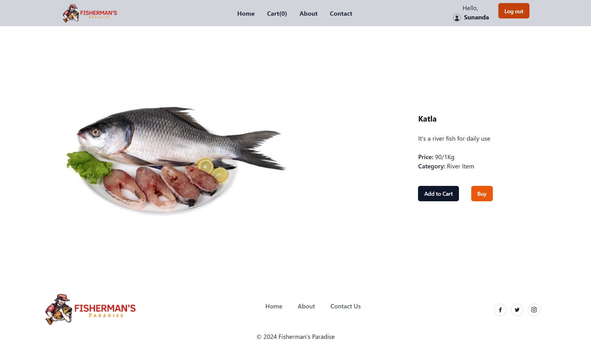</td>
  </tr>
<tr>
    <td>About Page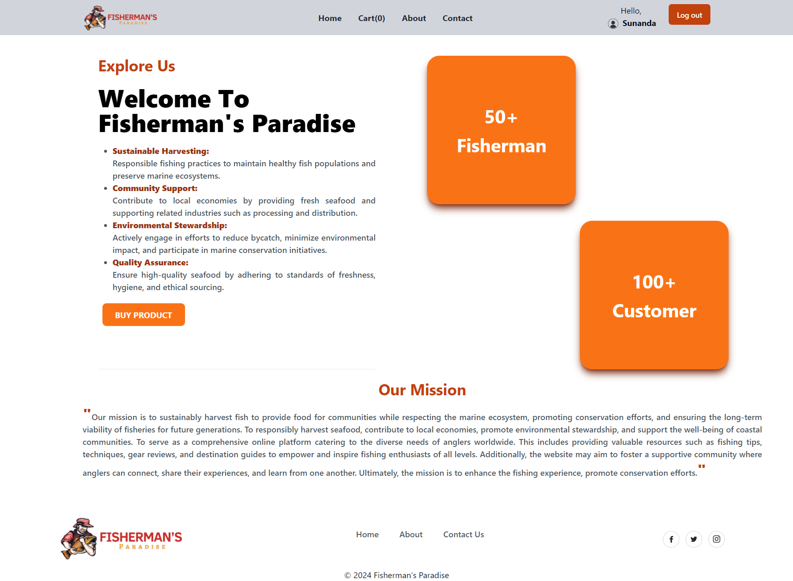</td>
    <td>Contact Page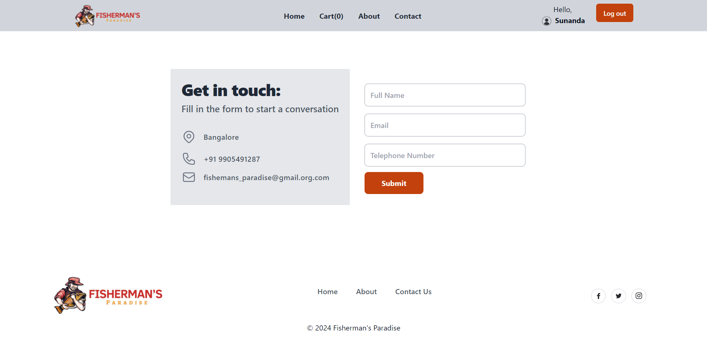</td>
  </tr>
<tr>
    <td>Cart Page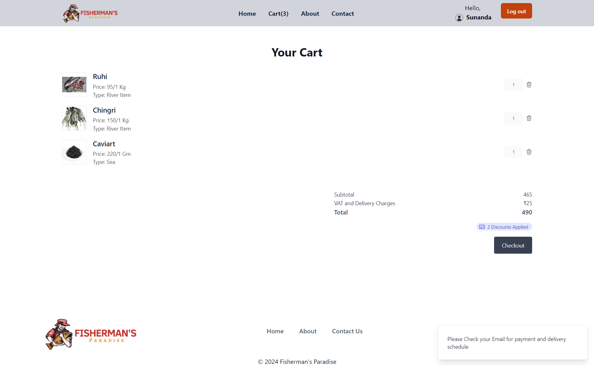</td>
    <td>Admin Dashboard Page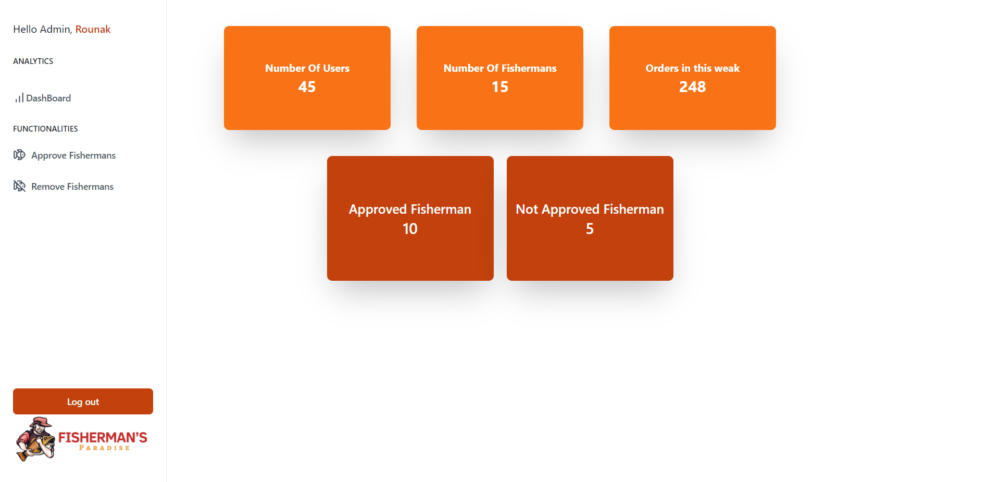</td>
  </tr>
<tr>
    <td>Admin Fisherman Approve Page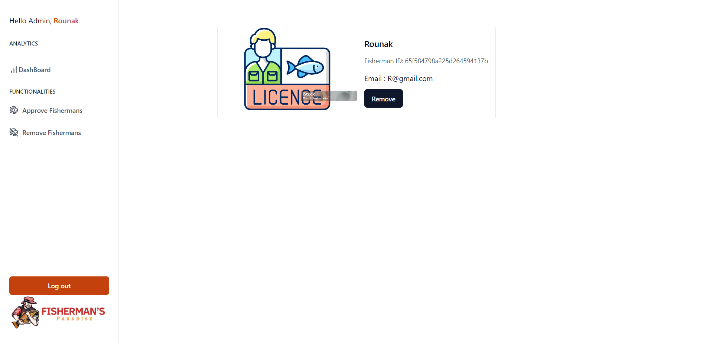</td>
    <td>Admin Fisherman Revoke Page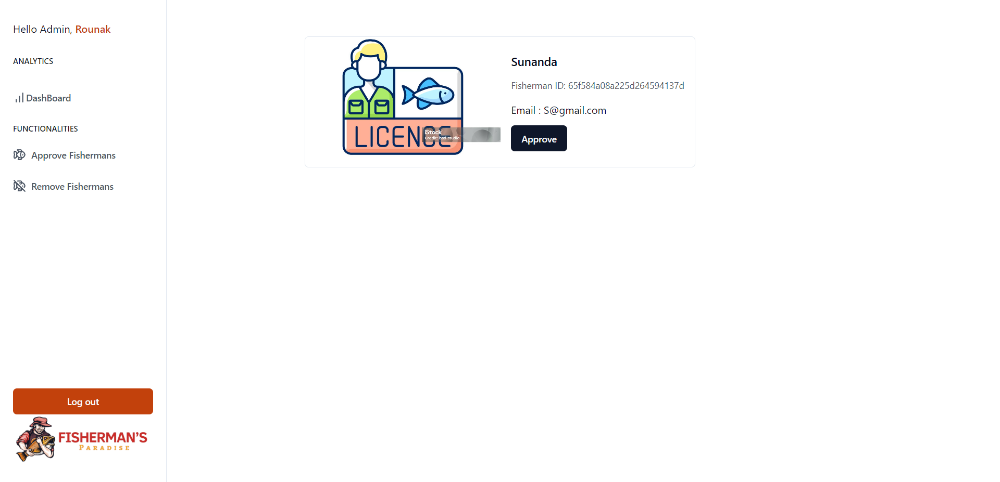</td>
  </tr>
<tr>
    <td >Fisherman Not Approved Functionality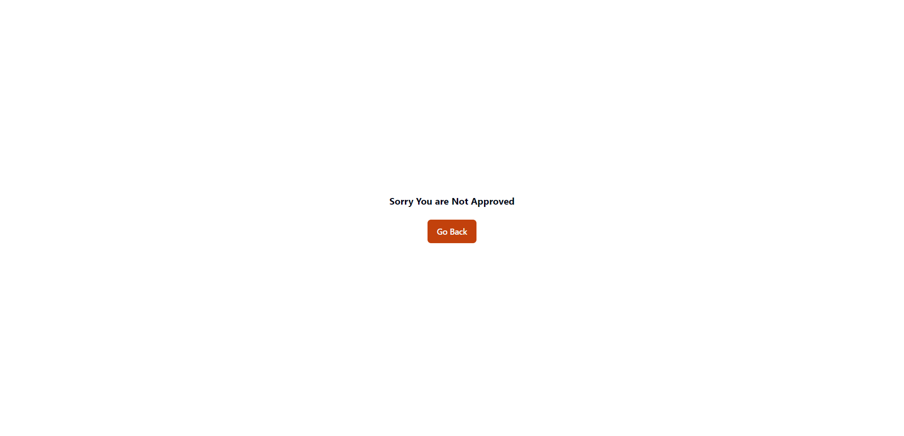</td>
    <td>Fisherman Add Product page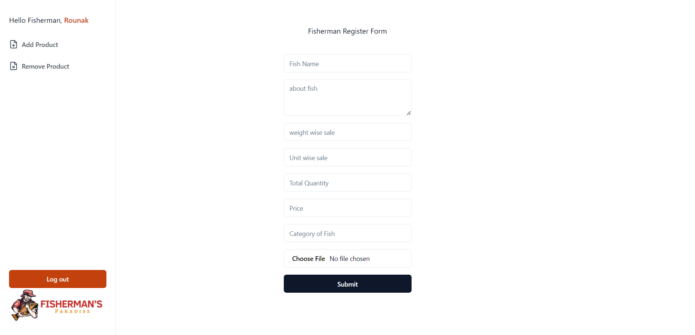</td>
  </tr>
<tr>
    <td colspan="2">Fisherman Remove Product Page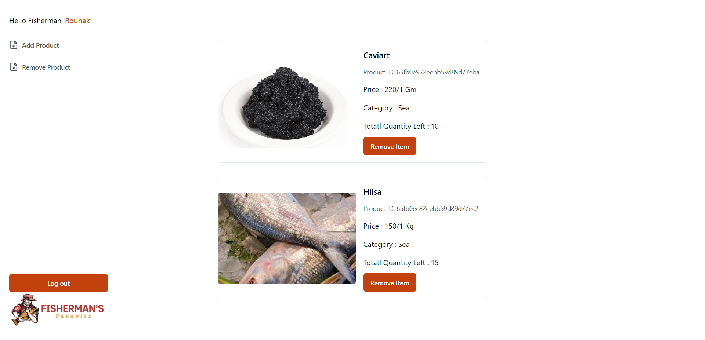</td>
  </tr>
 </table>

 
## Backend Repository
> https://github.com/Rounak00/fishermans_paradise_backend
